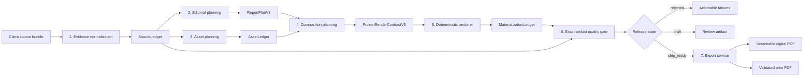

# DMC Report Compiler Architecture Design

Date: 2026-08-03

Status: Phase Zero approved design

## Purpose

This design replaces a permissive pipeline of overlapping heuristics with a report compiler whose decisions are explicit, testable, and traceable from source evidence to final PDF bytes.

The desired system must achieve two goals at once:

1. Reproduce the stable editorial and quality grammar demonstrated by Richard's six reference reports.
2. Create fresh, client-specific compositions without becoming arbitrary, ungrounded, or visually repetitive.

The system is not a fixed twenty-page template. It is a constrained creative compiler.

## What Phase Zero has mapped

The reference atlas covers every one of the 120 physical A4 faces in the six PDFs. It records page role, dominant composition, theme, evidence type, asset use, density, and word count. This is enough to define the stable product grammar and the first validated composition families.

The live code audit traces the full current call path, including adapter behavior, schema permissiveness, asset routing, treatment selection, Chromium rendering, quality gates, and Ghostscript flattening. A fresh Christopher build proves the observed failure behavior.

Mapped with high confidence:

- Physical face count and spread semantics in all six references
- Stable page roles and ordering tendencies
- Exactly-three case-study structure
- Major composition families and dominant reading mechanisms
- Relative copy-density ranges by editorial role
- Asset roles visible in the references
- Typography role separation and page cadence patterns
- Current runtime call graph and active fallbacks
- Current validation, test, and ship-gate behavior
- Current output's structural and visual failures

## What remains to be calibrated

Phase Zero does not claim a complete reconstruction of Richard's private design process. The following remain unknown or only partially measured:

- Exact source grids, baseline systems, and original design tokens
- Every component's internal geometry across all 120 faces
- Machine-calibrated capacity limits for every composition and language pattern
- Richard's internal reasoning when selecting between two plausible compositions
- Source-image provenance for every reference PDF
- Original Illustrator or InDesign files
- The lost copy-law document and missing newer reference PDFs
- The deployed n8n workflow and its exact prompt versions
- Performance across several genuinely different client inputs
- A visual scorer calibrated to Richard's own acceptance judgments
- Which historical tests remain valid product requirements

These unknowns do not prevent the architecture from being designed. They change how it must be designed: exact creative choices remain versioned hypotheses until they pass a promotion process. Semantic and safety invariants can be authoritative now because they are either universal in the corpus or required for correctness independent of style.

## Governing decision

Make semantic, evidence, capacity, accessibility, and export rules authoritative. Keep art direction and composition selection flexible within validated families. Admit new creative behavior only through a measured promotion path.

This decision follows from three observations:

1. The references vary significantly in typography, darkness, illustration, and page treatment, so a single rigid skin would not be faithful.
2. They are highly consistent in product structure, evidence discipline, case count, reading hierarchy, and dominant-mechanism behavior, so those rules should not be advisory.
3. The current system already has many isolated creative capabilities, but permissive boundaries allow missing proof, wrong counts, silent fallback, and weak composition to ship.

Richard's house grammar is therefore the default authority, with Apex-level polish as the quality floor. Per-client variation happens through tokens, assets, and composition selection inside that grammar. Open-ended art direction can exist as an experimental mode, but it cannot become ship-ready until promoted.

## Authority boundaries

```text
Source ingestion decides what the client actually supplied.
Evidence normalization decides what can be asserted and how it is cited.
Editorial planning decides what the report argues and which face proves each point.
Asset planning decides what visual evidence is required and what substitutions are legal.
Composition planning decides which validated family can express the page within capacity.
The renderer executes the frozen plan without semantic invention.
The quality gate evaluates the exact produced artifact and assigns a release state.
The postprocessor exports digital and print variants without redesigning content.
```

The preprocessor decides what. The renderer decides how within the selected family. The postprocessor validates and exports. It never repairs semantics or redesigns a page.

## Canonical document units

The system uses four distinct units and never calls them all pages:

| Unit | Definition |
|---|---|
| Face | One physical A4 reading surface. The DMC house product defaults to 20 faces. |
| Spread | Two adjacent faces designed as one A3 landscape composition. |
| Render fragment | One top-level HTML section consumed by the PDF renderer. It may represent one face or one spread. |
| PDF object | One page object in the PDF file. An A3 spread is one PDF object but two faces. |

Every plan and artifact carries all four counts. A count is valid only when its unit is named.

## Target architecture



## Contract 1: SourceLedger

The evidence normalizer produces an immutable ledger before any editorial rewriting.

Required fields for each source item:

- `source_id`
- `source_kind`: interview, website, document, social, client_upload, external_reference
- `locator`: file path or URL plus page, paragraph, timestamp, or DOM selector
- `captured_at`
- `content_hash`
- `rights_status`
- `verbatim_text`
- `language`

Required fields for each claim:

- `claim_id`
- `claim_type`: fact, number, quote, credential, interpretation, promise
- `normalized_value`
- `unit`
- `time_scope`
- `entity_scope`
- `source_ids`
- `source_spans`
- `confidence`
- `allowed_uses`

Rules:

- Every number, quote, credential, named client result, and certification in a ship-ready report must reference at least one source span.
- Computed claims store the formula and all operands.
- Interpretations are labeled as interpretations and cannot masquerade as facts.
- The adapter cannot create claims.
- A visual may use a number only through a claim ID, never through free text matching.

## Contract 2: ReportPlanV3

The editorial planner produces a face-level plan before layout begins.

Report-level fields:

- `product_profile`: defaults to `dmc_house_20_face`
- `face_count_target`
- `spread_plan`
- `audience`
- `central_thesis`
- `promise`
- `tone_profile`
- `source_coverage`
- `exception_justifications`

Face-level fields:

- `face_id`
- `face_index`
- `role`
- `narrative_act`
- `argument`
- `claim_ids`
- `proof_requirements`
- `asset_requirements`
- `dominant_mechanism`
- `density_band`
- `transition_in`
- `transition_out`
- `case_id` or `theory_for_case_id` where applicable

House-profile invariants:

- Exactly 20 physical faces unless an explicit product exception is approved.
- Exactly three case studies.
- Each case has problem, intervention, result, and evidence completeness.
- Each case is followed or supported by an explicit interpretation.
- Cover, outlook, authority, status quo, false beliefs, summary, objections, collaboration, and final CTA are present.
- Trust evidence appears in the plan, whether or not it receives a dedicated face.
- One face has one dominant reading mechanism.
- A3 spread allocations count as two faces and one render fragment.

The legacy ST codes can remain as compatibility metadata, but they are not the semantic contract.

## Contract 3: AssetLedger

Every asset is classified before it is assigned to a composition.

Required fields:

- `asset_id`
- `semantic_class`: identity, proof, product, process, context, decoration, texture, logo, qr, source
- `provenance_kind`: client_supplied, client_public, licensed, generated, derived
- `source_locator`
- `rights_status`
- `content_hash`
- `pixel_dimensions`
- `print_resolution_at_use`
- `allowed_face_ids`
- `required_for_ship`
- `substitution_policy`
- `generation_recipe` when generated

Rules:

- Identity and proof assets cannot be replaced by product, context, or decorative assets.
- Generated identity, testimonial, credential, or outcome evidence is forbidden.
- Missing required assets block ship readiness.
- Context and decoration may be selected judgmentally from an approved bank.
- The final package records the exact asset bytes and their source.

## Contract 4: CompositionFamily

A composition family is a tested layout system, not a template name.

Each family declares:

- Supported editorial roles and dominant mechanisms
- Supported face formats
- Required and optional regions
- Region capacities for German and English copy
- Supported asset semantic classes
- Minimum and maximum evidence bundles
- Typography roles and bounded scale ranges
- Alignment and grid rules
- Theme and cadence affordances
- Accessibility constraints
- Known failure modes
- Golden reference faces
- Automated tests and calibration status

Initial families should be extracted from the atlas rather than invented from the existing treatment catalog:

1. Editorial lead with anchored proof
2. False-belief stack
3. Case narrative with identity proof
4. Theory interpretation with one diagram
5. Horizontal mechanism spread
6. Summary synthesis
7. Objection-response system
8. Collaboration or process pathway
9. Evidence or review wall
10. Closing CTA

Each family can have bounded variants. A variant changes hierarchy or geometry without changing the family's semantic promise.

## Contract 5: FrozenRenderContractV3

The composition planner materializes one strict contract that the renderer cannot reinterpret.

Each render fragment contains:

- `fragment_id`
- `face_ids`
- `format`
- `composition_family_id`
- `composition_version`
- `variant_id`
- `theme_id`
- `element_tree`
- `region_assignments`
- `content_refs`
- `claim_refs`
- `asset_refs`
- `required_visibility`
- `fit_policy`
- `fallback_policy`
- `expected_materialization`

The schema uses discriminated unions for elements such as heading, body, quote, stat, comparison, process, image, source, and QR. Arbitrary dictionaries and unknown extras are rejected.

Ship mode forbids semantic fallbacks. If the selected family cannot render, the build fails and returns ownership to the composition planner. Draft mode may use a named fallback, but the release state remains draft and the degradation is recorded.

## Composition planning

The planner scores feasible families using five dimensions:

1. Semantic fit: can the family express the page's argument and dominant mechanism?
2. Evidence fit: can it present the required claims and proof bundle without omission?
3. Asset fit: are the required semantic asset classes present and legal?
4. Capacity fit: do measured regions fit the copy, data, and images at approved typography bounds?
5. Cadence fit: does the choice improve the report's rhythm without repetitive adjacency?

The planner selects from feasible families only. If none fit, it returns a structured planning failure instead of forcing a layout.

Backtracking order:

1. Try another validated variant in the same family.
2. Try another feasible family for the same dominant mechanism.
3. Return to editorial planning to shorten, split, or reprioritize content.
4. Return to asset planning if a missing proof asset caused infeasibility.

The renderer is never asked to solve an editorial overcapacity problem by shrinking text below the approved minimum.

## Renderer

The renderer becomes intentionally less intelligent.

Responsibilities:

- Load and strictly validate `FrozenRenderContractV3`.
- Render the named composition version.
- Apply bounded typography and spacing tokens.
- Emit stable element IDs into the DOM.
- Measure final geometry.
- Produce raw searchable PDF, PNGs, and a `MaterializationLedger`.

Non-responsibilities:

- Choosing a different composition
- Reassigning assets to different semantic roles
- Creating or rewriting claims
- Inferring missing page data
- Silently falling back in ship mode
- Deciding whether a report is ready to ship

## MaterializationLedger

For every required element, the renderer records:

- Planned element ID
- Final DOM selector
- Bounding box
- Face or spread coordinates
- Computed font size and line height
- Visibility status
- Clipping status
- Overlap relationships
- Contrast result
- Referenced claim and asset IDs

This ledger connects the frozen plan to the final pixels. It allows quality failures to name the responsible stage rather than merely report that a page looks wrong.

## Quality and release states

The quality gate runs on the exact raw PDF, rendered PNGs, frozen contract, source ledger, asset ledger, and materialization ledger.

Release states:

| State | Meaning |
|---|---|
| Rejected | A structural, evidence, materialization, or export invariant failed. No PDF is delivered as a candidate. |
| Draft | Structurally renderable, but known non-blocking quality gaps or approved placeholders remain. |
| Review candidate | All deterministic gates pass and human calibration is required. |
| Ship ready | Deterministic gates pass, required assets exist, visual threshold is met, and the export profile passes. |

Hard failures include:

- Wrong face, spread, fragment, or PDF-object count
- Missing required page role or wrong case count
- Unproven number, quote, credential, or named result
- Missing required identity or proof asset
- Illegal asset-class substitution
- Missing required visible element
- Clipping, collision, unreadable text, or unsafe contrast
- Silent fallback from the frozen composition
- Missing source appendix or mandated legal copy
- Export-profile failure

Visual scoring evaluates hierarchy, composition, typography, rhythm, density, proof visibility, and family-specific criteria. It supplements deterministic checks; it cannot waive hard failures.

## Digital and print exports

The raw searchable PDF is the canonical rendered artifact.

Digital export requirements:

- Searchable and selectable text
- Preserved links and metadata
- Tagged accessibility where the rendering stack supports it
- Embedded or properly subset fonts
- Reasonable file size
- Screen color profile

Print export requirements are printer-profile dependent:

- Explicit PDF standard
- Output intent and ICC profile
- Color conversion policy
- Bleed and crop policy
- Image effective-resolution checks
- Total area coverage limit
- Font and transparency checks
- Preflight report

Flattening is an optional printer workaround, never the default delivery artifact and never a substitute for preflight.

## Design-skill integration

The external design repositories are useful inputs, but they are not runtime authorities.

[TypeUI](https://github.com/bergside/typeui) provides a broad library of UI styles, fundamentals, and reusable design prompts. [Designer Skills](https://github.com/Owl-Listener/designer-skills) makes design research, systems, critique, data visualization, and handoff judgment explicit in modular skills. Both primarily target interactive product design rather than print editorial reports.

The integration model is:

1. Snapshot a licensed source version and retain attribution.
2. Select only relevant principles: visual hierarchy, typography, composition, information density, design tokens, critique, data integrity, and handoff.
3. Translate each principle into a print-specific policy against the DMC atlas.
4. Classify it as invariant, planner feature, composition-family guidance, deterministic validator, or human rubric.
5. Test it against all six references and multiple client fixtures.
6. Promote it only if it improves measured output without violating evidence or product grammar.

Do not paste hundreds of web-design skills into the live prompt. Do not allow a skill to choose arbitrary aesthetics at render time. The useful outcome is a versioned `DesignPolicyRegistry` consumed by planning, family authoring, validation, and critique.

## Creativity promotion path

New composition families and visual behaviors move through five states:

1. Experimental: available only in isolated renders.
2. Curated candidate: reviewed by a designer and documented with intent.
3. Corpus tested: renders representative pages from all six reference families.
4. Client tested: passes diverse fixtures and exact-artifact QA.
5. Promoted: versioned in the production family registry with golden outputs.

A production family can be deprecated but never silently changed. Existing jobs retain the family version used for their build.

## Calibration plan for the unmapped details

The remaining unknowns are mapped in the implementation program rather than guessed:

- Measure grid, margins, type roles, and regional capacities from all atlas faces.
- Encode only the first ten well-supported families.
- Re-render representative source copy through each family and measure fit.
- Compare composition outputs through blind human scoring.
- Add at least four diverse client fixtures before calling the planner robust.
- Capture Richard's accept or reject judgments as calibration data when available.
- Reconcile every stale test with the new authority table.
- Re-download the missing reference PDFs and copy-law source before final copy-policy freeze.

This is the correct relationship between mapping and building: map universal structure first, build strict contracts around it, and treat detailed aesthetic behavior as measurable hypotheses until calibrated.

## Migration strategy

The migration is incremental but has one canonical destination.

1. Introduce the new ledgers and contracts beside the current package.
2. Produce both legacy package v2 and frozen contract v3 from the same fixture.
3. Build one vertical slice using the new contract and one composition family.
4. Add the materialization ledger and blocking ship-state gate.
5. Expand families and migrate all stable roles.
6. Move HTTP service to v3 only after parity and quality thresholds pass.
7. Delete legacy inference and fallback only after every supported fixture uses v3.

During migration, a response must identify whether it came from legacy v2 or contract v3. A v2 artifact can never be labeled ship ready under the new system.

## Acceptance criteria for the architecture

The architecture is implemented when:

- A source claim can be traced to every shipped fact and visual number.
- One declared 20-face plan produces exactly 20 physical faces, with explicit spread accounting.
- Exactly three complete case studies are enforced for the house profile.
- Missing required proof blocks ship readiness.
- The planner selects only capacity-feasible, evidence-feasible composition families.
- The renderer executes a strict contract without semantic inference or silent fallback.
- Every required element appears in the materialization ledger.
- The exact shipped artifact passes deterministic and calibrated visual gates.
- Digital export preserves searchable text.
- Print export has an explicit, verified printer profile.
- A build records all schema, policy, family, asset, model, and tool versions needed to reproduce it.
